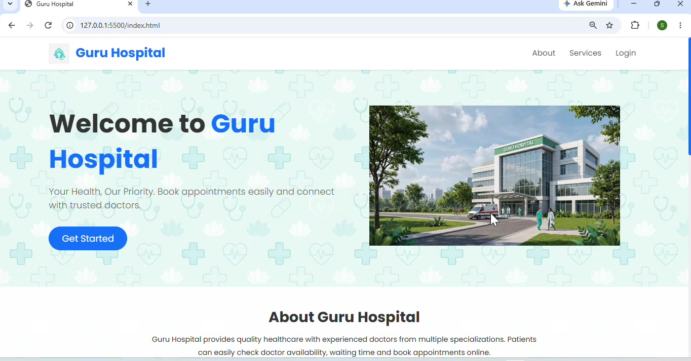
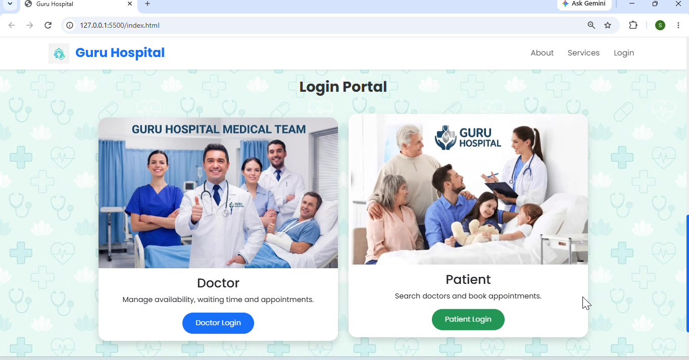
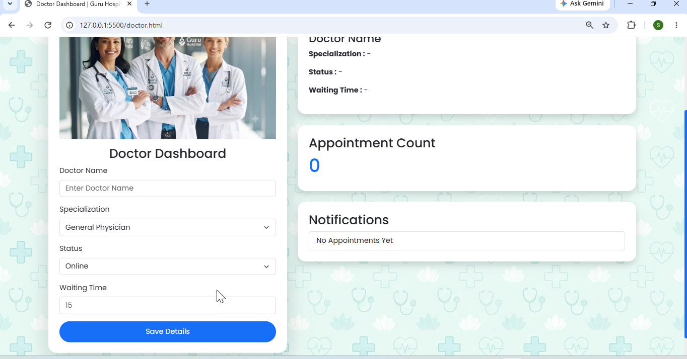
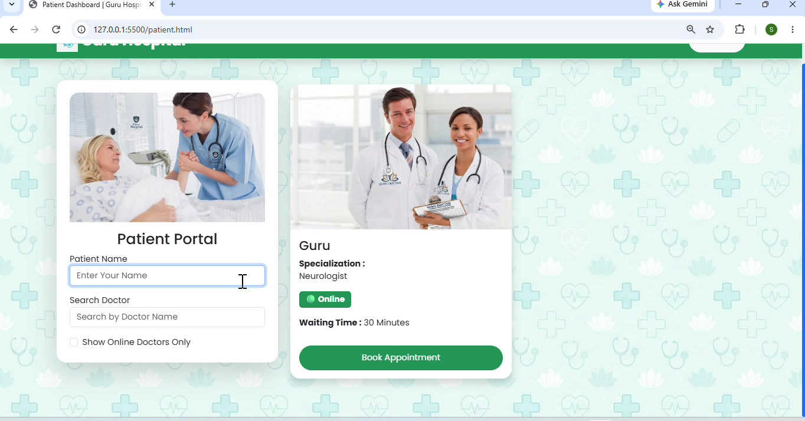

# Guru-Hospital

# 🏥 Guru Hospital – Doctor & Patient Appointment Portal

Guru Hospital is a web-based healthcare portal that connects **doctors** and **patients** through simple, real-time dashboards. Doctors can update their live availability, status, and waiting time, while patients can search for doctors and book appointments instantly.

---

## 📸 Screenshots

### Home Page

### Login Portal

### Doctor Dashboard

### Patient Dashboard

---

---

## 📂 Project Structure

guru-hospital/
├── index.html          # Landing page (Home, About, Services, Login)
├── doctor.html          # Doctor Dashboard
├── patient.html         # Patient Dashboard
├── style.css            # Stylesheet
└── images/               # Logos, banners, and illustrations
    ├── Hospital_Logo.png
    ├── Hospital_Banner.png
    ├── Hospital_Background.png
    ├── Doctor_12.png
    ├── Doctor_home.png
    └── Patient_home.png
---

## 🖥️ Usage

1. Open the **Home Page** and navigate to **Login**.
2. Choose **Doctor** or **Patient** login.
3. **As a Doctor:** enter your name, specialization, status, and waiting time — this updates live for patients.
4. **As a Patient:** search for a doctor by name, filter by online status, and book an appointment.

---

## 🌐 Live Demo

🔗 [View Live Demo](https://srigurudharshini123.github.io/Guru-Hospital/)

---

## 👤 Author

**Sri gurudharshini**
📍 Salem, Tamil Nadu, India

---

